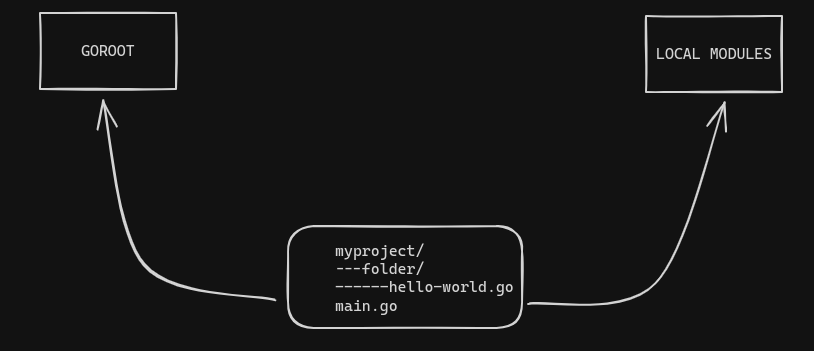

# Study Notes on Golang

- [Study Notes on Golang](#study-notes-on-golang)
  - [Basic Concepts](#basic-concepts)
  - [Hello World :=](#hello-world-)
  - [Variables](#variables)
  - [Pointers](#pointers)
  - [Array](#array)
  - [Slices](#slices)
  - [Maps](#maps)
  - [Functions](#functions)
  - [Structs](#structs)
  - [Methods](#methods)
  - [Interfaces](#interfaces)
  - [Generics](#generics)
  - [Modules](#modules)
  - [Reference](#reference)

## Basic Concepts


**Camel Case**

[Golang](https://golang.org/) uses Camel Case for styling variable and function names.

> [!Important]
> **Best Practices:**
> - `QuoteRuneToASCII` or `parseRequestLine`
>
> **Not Recommended:**
> - `quote_rune_to_ASCII` or `parse_request_line`

**Reserved Words**

```go
break     default      func   interface   select
case      defer        go     map         struct 
chan      else         goto   package     switch
const     fallthrough  if     range       type
continue  for          import return      var
```

**Types**

```go
int int8 int16 int32 int64
uint uint8 uint16 uint32 uint64 uintptr
float32 float64 complex128 complex64
bool byte rune string error
```

**Binary Operators**

```go
* / % << >>& &^
+ - | ^
== ≠ < <= > >=
&&
||
```
> [!Important]
> The operator % is applied only to integer numbers.

**Build process**

In golang its possible define operation system and architecture when compile files `*.go`. To compile files use comand `go build file.go` or `go build` in root folder.

> [!Important]
> Exist town varibles in operation system GOARCH and GOOS
> GOARCH is architecture
> GOOS is operation system

Print in variables:
```bash
$ go env GOOS GOARCH
linux
amd64
```

List all architecture and operation system:

_I execute in my ubuntu_

```bash
go tool dist list
aix/ppc64
android/386
android/amd64
android/arm
android/arm64
darwin/amd64
darwin/arm64
dragonfly/amd64
freebsd/386
freebsd/amd64
freebsd/arm
freebsd/arm64
freebsd/riscv64
illumos/amd64
ios/amd64
ios/arm64
js/wasm
linux/386
linux/amd64
linux/arm
linux/arm64
linux/loong64
linux/mips
linux/mips64
linux/mips64le
linux/mipsle
linux/ppc64
linux/ppc64le
linux/riscv64
linux/s390x
netbsd/386
netbsd/amd64
netbsd/arm
netbsd/arm64
openbsd/386
openbsd/amd64
openbsd/arm
openbsd/arm64
plan9/386
plan9/amd64
plan9/arm
solaris/amd64
wasip1/wasm
windows/386
windows/amd64
windows/arm
windows/arm64
```

---

## Hello World :=

---


**Simple Package and How to Use**

By default, every Golang project has a file named `main.go`, which serves as the entry point of the project.

```go
package main

import "fmt"

func main(){
    fmt.Println("Hello, my friend")
}
```

**Line by Line Explanation**

```package main```

Every Go file is associated with a package, and the `main` package is used only for the project's entry point.

[Example](simple-packages-and-main)

```import fmt```

This line imports the "fmt" package, which is used to print messages to the terminal.

```func main() {}```

The `main` function is the entry point of the Go program, and every core file should have this function.

```fmt.Println("Hello, my friend")```

This line uses the `fmt` package's `Println` function to print the message "Hello, my friend" to the terminal.

> [!Important]
> What happens when you don't declare the `main` package in the root folder?
> _You will encounter an error when the `main` function is missing in the root file._

```bash
$ go run main.go 
# command-line-arguments
runtime.main_main·f: function main is undeclared in the main package
```

_When the `main` package is missing in the root file:_

```bash
$ go run main.go
package command-line-arguments is not a main package
```

---

## Variables

---
> [!Note] 
> **Variable Lifetime**
> According to Donavan (2017), "the lifetime of a variable is the time interval during which it exists while the program runs" (p. 73).


**Starting with the Basics**

To define a variable in Go:

```
var name type = expression
```

- You can use both signed and unsigned values:
    -  int8, int16, int32, int64

- In Go, it's not allowed to declare a variable and not use it. In such cases, you should use an underscore `_` after the variable. Here's an example:

```go
package main

import "fmt"

func main(){
    var x int  // not using the variable
    var y int = 1

    fmt.Println(y)
}
```

```bash
go run main.go
# command-line-arguments
./main.go:9:9: x declared and not used
```

> [!Important]
> When to use global variables?
> When declaring global variables (at the package level), the compiler won't produce errors.

**Declaration Variations**

- Global Variables
```go
var x int = 1 // assigns a value
var y int // without a value
func main(){ 

}
```
- Local Variables
```go
func main(){
    // These local variables can only be seen in this function
    var x int
    var buzzy = true
}
```
- Short Declaration of Variables
```go
func main(){
    x := 3 // declares, assigns a value, and defines the type
}
```

**Zero Value**

> [!Note]
> You can find information about the `fmt` package in the [fmt package documentation](https://pkg.go.dev/fmt).

[Zero Value](variables/variable-zero.go)

In my studies about zero values:

- When you don't assign a value to a variable in Go, it is assigned a zero value.
- For boolean variables, `false` corresponds to 0, and `true` corresponds to 1.
- In variables with no return, you need to use an underscore `_`.
- An uninitialized string in Go comes with the value: "".

**Named Types**

In Go, you can create named types. For example:

```go
type name string
```

---

## Pointers

---


> [!Note] 
> I created a folder for pointer-related files, but this topic is within the variables section.

Using pointers in Go is useful when you need to make values mutable or when you want to pass large values to functions without copying them. In my code [pointer-function.go](basic/pointers/pointer-function.go), I'm not trying to say that the sums are incorrect; it's just a demonstration.

[Go 101](https://go101.org/article/pointer.html)


---

## Array

---
Array is a sequence of the values, where it may contain zero or many values.

Declaration **array**: 

> _Declaration with type, but without values_

```go 
var a[10] int
```

> _Declarations with type and inicialization values_

```go
var b [5]int = [5]int{1, 2, 3, 4, 5}
```

> _Declaration variable without type (Type Inference Declaration), but inilization values_

```go
c := [2]float32{1.1, 2.1}
```

When use `[...]` in the declaration array means defined size amount of statup.
For example:

[My example](arrays/compare.go)

> [!Note]
> In this example, compiler count the array elements.

```go
b := [...]int{1, 2}
``````

> [!Note]
> In the example inicialization the values {1, 2} defined size of the array.

**Commpare arrays**

It is possible compare values between arrays, below I will demonstrate examples:

_The comparison is done within the array and the values_

```go
package main

import "fmt"

func main(){
	a := [2]int{1, 2}
	b := [...]int{1, 2}
	c := [2]int{2, 1}

	fmt.Println(
		a == b, 
		a == c, 
		b == c,
	)

}
```

> [!Important]
> When compare arrays that has diferent types, for example
> `d := [2]float32{2.1, 2.3}	 == c := [2]int{2, 1}`
> How different types will present this error.
> `./erros.go:15:8: invalid operation: c == d (mismatched types [2]int and [2]float32)`
 
---

## Slices

---
_So, for now my study about Slices_

Slice is similar to an array, but has its variable size, below example of the declaration:

```var months []T string```

The notation **[]** is specific to slices. The slices has three components:
- pointer ->  Point to the first element's availability.
- lengh -> The lenght is the number elements of the slice. (_Lenght cannot exceded limit capacity_)
- capacity -> The number of the elements between begnning of the slice and finaly of the array.


> **Declaration slices**

Literal Expression

_Basic declaration of a slice_

```go
mySlice := []int{1, 2, 3}
```

Empty Slice

_We can create empty slice and atributed elements using append._

> [!Note] 
> Verify example
> [Example using append](slices/using-append.go)

> [!Important]
> Function append is very common in slices, but attencion when use because if you exceed capacity the next value is 2 x capacity.


```go
var mySlice []int
```

Slice from an array
 
Its possible create slice from an array

```go 
myArray := [5]int{1, 2, 3, 4, 5}
mySlice := myArray[1:4]
```

Using make

_Use to create a slice with capacity and lenght_

> [!Note]
> In the example number 3 represent lenght and 6 capacity.

```go
mySlice := make([]int, 3, 6)
```

---

## Maps

---

Maps in golang is a collection of key and value, when the keys is unique and values can you modifie (for example, update).

I describe maps, but demonstrate the map structure:

Basic map:

```map[key]value```


> [!Important]
> Maps is a reference [Hash Tables](https://en.wikipedia.org/wiki/Hash_table)


> **Declaration maps**


Using make

In below example create map with types key and value

_In this case create empty map_

```go
myDays := make(map[string]string)
months := make(map[int]string)
```

Empty (Literal notation)

```go
myMap := map[string]int{}
```

Initial values

```go
score := map[string]int{
    "user1": 100000,
    "user2": 200000,
}
```

Using function

Its possible create maps using return of a function, verify the example: [maps](maps/function.go)

---

## Functions

---

Functions are block code with propose execute same task in code.

Basic function
```go
func _name_(list of parameters) (list of results){
    Operation of function
}
```

- List of parameters are local variabels using in function.
- The values of the arguments are given in the function call.

```go
func exampla(Argument1 int, Argument2 float32)(int, float32)
```
**Line by line**

`Argument1 int` and `Argument2 float32` 

- The variables are local variables the function

`(int, float32)`

- Are return the function, so one **float32** and **int**

> [!Note]
> The variables initialize with value zero.


In golang its possible many **returns**, so when necessary returns of type **string**, **int** or **float**, for example see in code [many return](functions/func-parametrs.go).

> [!Important]
> File *func-parametrs.go* have others example using return and parameters.


**Work with errors**

Erros are common problems of code:
- Connection with DB
- E/S
- Copy files
- Etc ...

> [!Note]
> The code failure can always happen

|      Working                                          |
|-------------------------------------------------------|
|All code have problem or bugs                          |
|When we have only one possible cause have boolean      |
|The error can be nil (success) or not nil (failure)    | 
|In golang don't have **try exception**                 |
|Propagate the error of a subroutine to the main routine|
|All messages have good description                     |
|In some cases you can **retry**                        |

**Values function**


**How to declare function**

Simple function

```go
func Sum(a, b int) int{
    return a
}
```

Anonymous
_In the function not have name_

- Discartable functions
- Used in goroutines

```go
func(){
    fmt.Println("Anonymous function")
}()
```

Higher-order

_These are functions that either accept other functions as arguments or return functions._


```go
func apply(nums []int, f func(int) int) []int {
    result := make([]int, len(nums))
    for i, n := range nums {
        result[i] = f(n)
    }
    return result
}
```

Variadic functions

*These are functions that can accept a variable number of arguments.*

```go
func sum(nums ...int) int {
    sumValues := 0

    for _, num := range nums {
        sumValues += num
    }
    return sumValues
}
```

> [!Important]
> Garbare Collection
> It is capable of recycling memory that is not being used, but is not able to release unused resources in the Operating System, so beware of open connections (databases, files and etc.).
---

## Structs

---

Now,talk about structs in golang

The structure is type data agregation when value zero or many named values.
Each value call field, for example:

```go
type Person struct{
    filed1 string
    field2 int
    field3 bool
    field4,field5 float32
}
```

Its possible create instantiation variable using structure, see example:

```go
type Person struct{
    Name string
    Age int
    Salary bool
}

var person Person

```

> [!Important]
> If fields write with minuscule letters meas that its value only be accessed within the package,
> but the opposite can be access externally

**Anonymous**

Anonymous struct is normal struct, but its not defined in code and without name, the declaration is very simple.

[anonymous](basic/structs/anonymous.go)

Is often use in case when not reuseble values the struct, for example, in HTTP handlers.


---

## Methods

---

Basically in golang methods are variables configured in methods.

**Declaration**

_Value receiver_

```go
func (u User) Person() {
    u.Active = true
}
```

_Pointer receiver_

- This type declaration use when modify value of receiver

```go
func (u *User) Person(){
    u.Active = true
}
```

> [!Note]
> When use value or pointer receiver?

Value Receiver:

- Value Copy:
    
    When using a value receiver, the method receives a copy of the value. Changes inside the method do not affect the original value.

- Efficiency:
    
    In general, using value types is more efficient in terms of memory allocation and performance, as it does not involve pointers and dereferencing.

Pointer Receiver:

- Reference to the Original Value:
    
    When using a pointer receiver, the method receives a reference to the original value. This means changes inside the method directly affect the original value.

- Efficiency:
    
    Using pointer types may involve more memory allocations, but it allows direct modification of the original value.

> [!Warning]
>  Value receiver: Not necessary modify values, when you want work copys values and you want save on memory
> 
> Pointer: Modify value of objects in methods, flexibility, but many use memory


> [!Important]
> Not exist _this_ or _self_

- When we call a method, the argument for the receiver comes before the method name
- You can declare a methods in all type define
- When use methods of a type must have unique names, but methods diferent types you can use the same name.
- Without acess directly to the variables
- Clients don't have possibility of the modify variables directly


**Encapsulation**

When create variable or methods inaccessible we talk about encapsulation.

> [!Important]
> [Encapsulation](https://en.wikipedia.org/wiki/Encapsulation_(computer_programming))


---

## Interfaces

---

---

## Generics

---

---

## Modules

---

Use modules is very important to the code:

- Reading
- Reusable
- Maintaining

The golang use folder $GOPATH/src from manager all modules, but its possible create modules in root folder.

Following comand use to initialize module

```bash
go mod init name_module
```
When add module in the folder its possible use modules in root and in the project. Execute this `go.mod` command a new file created in this file see modules and version of golang.

```go
module github.com/aureliomalheiros/learn-languages

go 1.21.2
```
> [!Note]
> You can adding `required` in file `go.mod`



Verify the example in folder [Modules](modules).

To update package use comand:
```bash
go get package
```

> [!Important] **Export packages**
> The golang to use first letter of variables, methods, interfaces, structs, etc. To define if value is local or exported in project.
> A simple example is create variable in package and testing prinf.
> To use values in external packages define values in uppercase.

```go
package hello

import "fmt"

func helloModule(){
    fmt.Println("Hello module")
}
```
```go
package main

import "hello"

func main(){
    hello.helloModule()
}
```

You see erro when execute file `main.go`.

---

## Reference

| Title               | Link                                                                                             |
|---------------------|--------------------------------------------------------------------------------------------------|
| Golang documentation| [link](https://go.dev/ref/spec)                                                                  |
| Layout              | [link](https://go.dev/doc/modules/layout)                                                        |
| Ardan Labs          | [link](https://www.ardanlabs.com/blog/)                                                          |
| Anonymous Structs   | [link](https://blog.boot.dev/golang/anonymous-structs-golang/#:~:text=An%20anonymous%20struct%20is%20just,manageable%20for%20us%20as%20programmers.) |
|Introduced Generics |[link](https://go.dev/blog/intro-generics)
|Using modules | [link](https://go.dev/blog/using-go-modules)|
|Build files | [Link](https://www.digitalocean.com/community/tutorials/building-go-applications-for-different-operating-systems-and-architectures)
